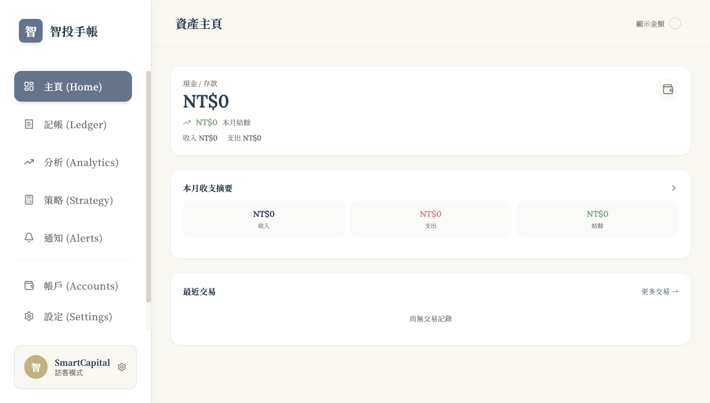
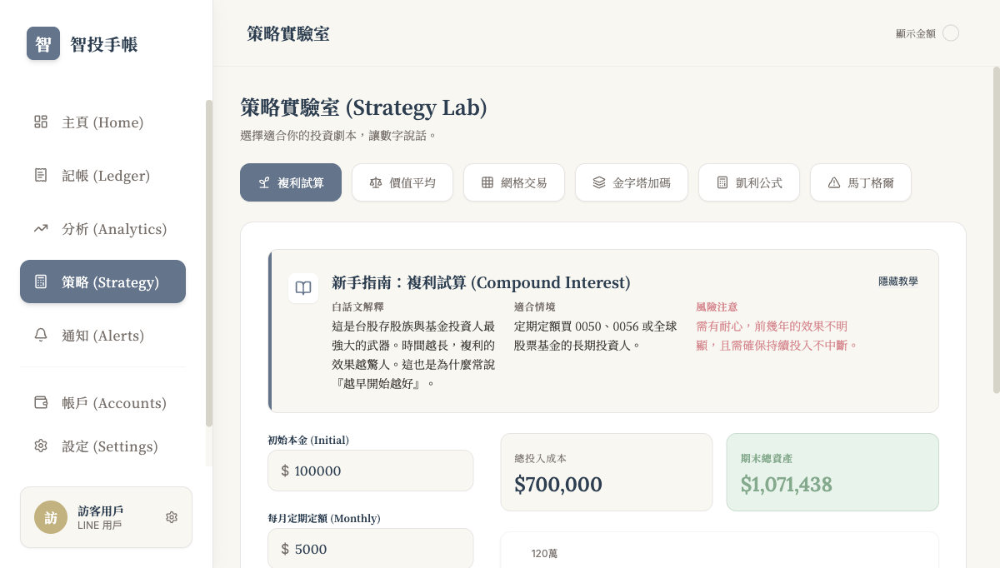
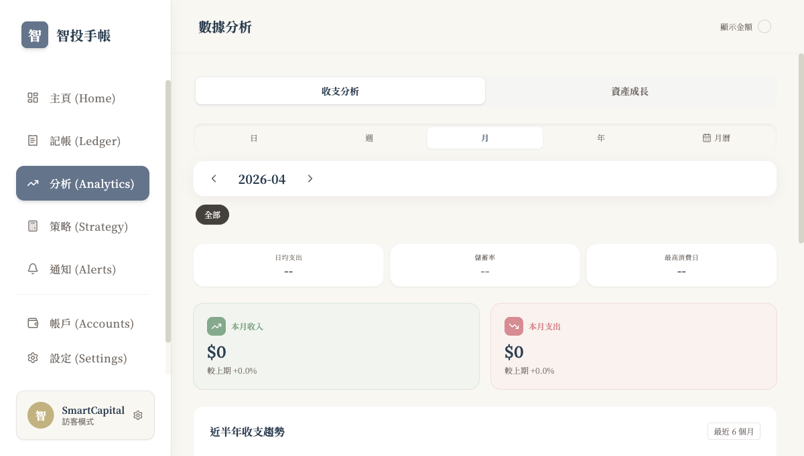
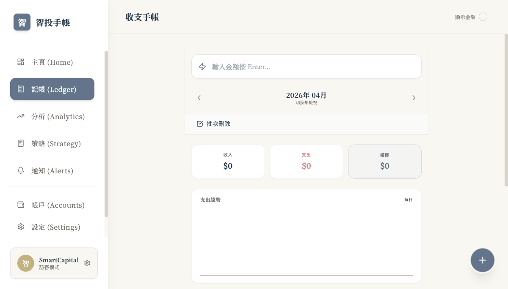

# SmartCapital

[](https://github.com/LAI-wen/SmartCapital/actions/workflows/ci.yml)

SmartCapital 是一個把「對話式記帳」與「投資追蹤分析」整合在一起的理財平台。系統由 Web 介面、LINE Bot、LIFF 登入流程與 Node.js 後端組成，目標是降低日常記帳摩擦，同時把資產、帳戶、警示與投資策略集中到同一套體驗中。

## 截圖

| Dashboard | 策略實驗室 |
|-----------|-----------|
|  |  |

| 數據分析 | 收支手帳 |
|---------|---------|
|  |  |

---

## 專案定位

多數個人理財工具只做其中一塊：

- 記帳工具偏重收支分類，但缺少投資視角
- 投資工具偏重持倉管理，但忽略生活現金流
- 聊天機器人雖然輸入快，但不易做後續分析

SmartCapital 的設計重點是把三件事接起來：

1. 在 LINE 中快速完成輸入
2. 在 Web 上集中檢視、調整與分析
3. 透過排程、警示與摘要形成持續回饋

## 核心功能

### Web 平台

- Dashboard：現金餘額、本月收支摘要、預算警示、最近交易、即時股價投資摘要
- Ledger：收支記錄、分類查詢與帳務回顧
- Analytics：依日、週、月、年檢視收支與資產變化；支援日曆模式點擊查看當日交易
- Strategy Lab：凱利公式、馬丁格爾與其他資金策略工具
- Account Management：多帳戶、轉帳與餘額管理
- Price Alerts：單日漲跌、停利、停損、目標價警示
- Budget Settings：各類別月預算設定與進度追蹤
- Settings / Onboarding：投資市場範圍、LIFF 與個人設定

### LINE Bot

- 輸入金額即可快速記帳
- 支援支出與收入分類選單
- 查詢台股、美股與持倉資訊
- 透過對話完成買入、賣出與投資紀錄
- 回傳 Flex Message 卡片顯示行情與建議
- 提供網站與帳本快速入口

### 後端與自動化

- JWT 驗證與 LIFF / 訪客登入流程
- Prisma 資料模型管理使用者、資產、交易、帳戶、預算與通知
- 即時股價（TWSE / CoinGecko / Finnhub）與匯率查詢，前端 60 秒快取
- 價格警示排程，每 5 分鐘檢查一次
- 每日摘要推播，整理用戶前一日收支活動
- 規則式交易分類預測與對話狀態管理

## 系統架構

```txt
LINE App / Browser
  ├─ LINE Bot 對話輸入
  └─ LIFF / Web Dashboard
          │
          ▼
Frontend (React + Vite + React Router)
  ├─ Dashboard / Ledger / Analytics / Alerts
  ├─ LIFF 初始化與使用者狀態管理
  └─ 呼叫 REST API
          │
          ▼
Backend (Express + TypeScript)  ← 部署於 Render
  ├─ Auth API
  ├─ Assets / Transactions / Accounts / Budgets API
  ├─ LINE Webhook Controller
  ├─ Stock / FX / Alert / Summary Services
  └─ Scheduler
          │
          ▼
Prisma + PostgreSQL
```

## 技術亮點

- 同時整合 Web 與 LINE Bot，讓輸入與分析發生在不同但互補的介面
- 使用 `LIFF + JWT` 建立登入與身分驗證流程
- 受保護 API 已補上 ownership 驗證，避免僅憑 `lineUserId` path 參數存取他人資料
- 以 `Prisma` 建立資產、交易、帳戶、預算、通知與價格警示資料模型
- 透過排程機制推動價格警示與每日摘要，讓系統不只被動展示資料
- 使用規則式分類預測與對話狀態機，讓記帳輸入更接近日常語言
- 在前端加入多市場範圍篩選、帳戶資金流與資產配置視覺化
- 前端已做 route-level lazy loading、Dashboard 圖表 / modal 按需載入，以及 LIFF 動態載入，降低首屏負擔
- GitHub Actions CI 自動跑前端（typecheck + lint + test + build）與後端（prisma generate + test + build）

## 技術棧

- Frontend: React 19, TypeScript, Vite, React Router
- UI / Charting: Tailwind CSS（CDN 配置）, Lucide React, Recharts
- Testing: Vitest, happy-dom
- Linting: ESLint, typescript-eslint, eslint-plugin-react-hooks
- CI: GitHub Actions
- Auth / Mini App: LIFF
- Backend: Node.js, Express, TypeScript
- Bot: `@line/bot-sdk`
- ORM / Database: Prisma, PostgreSQL
- Hosting: Vercel（前端）, Render（後端）
- Scheduling: `node-cron`
- AI / Parsing: Gemini API, rule-based category prediction
- Market Data: TWSE, CoinGecko, Finnhub

## 專案結構

```txt
smartcapital/
  App.tsx                 Web 主入口與路由殼層
  components/             Dashboard、Ledger、Analytics、Alerts 等頁面元件
  services/               前端 API 封裝與 domain services（含 price.service）
  contexts/               LIFF 與全域狀態
  server/
    src/
      controllers/        Auth、API、Webhook 控制器
      services/           stock、alert、summary、scheduler、parser 等服務
      middleware/         JWT 驗證中介層
      utils/              訊息解析與 Flex Message 模板
    prisma/
      schema.prisma       資料模型
      seed.ts             種子資料
  .github/workflows/
    ci.yml                GitHub Actions CI（前端 + 後端雙 job）
```

## 主要資料模型

- `User`：LINE 使用者與投資範圍設定
- `Account`：現金、銀行、券商與多幣別帳戶
- `Transaction`：收入、支出、轉帳與投資記錄
- `Asset`：股票 / ETF / 加密貨幣持倉
- `PriceAlert`：目標價、停利、停損與漲跌幅通知
- `Budget`：分類預算
- `Notification`：系統通知與價格警示紀錄

## 本地開發

### 1. 前端安裝與設定

```bash
npm install
```

複製 `.env.example` 並填入你的 key：

```bash
cp .env.example .env
```

```env
VITE_FINNHUB_API_KEY=your_finnhub_key   # 免費 key：https://finnhub.io
VITE_API_URL=http://localhost:3000
VITE_LIFF_ID=your_liff_id              # 若未提供則以訪客模式啟動
```

目前 `vite.config.ts` 預設前端埠號也是 `3000`。若要和後端同時本地開發，建議以前端改埠方式啟動：

```bash
npm run dev -- --port 3001
```

### 2. 後端安裝與設定

```bash
cd server
npm install
```

建立 `server/.env`，至少補齊：

```env
PORT=3000
JWT_SECRET=your_jwt_secret
LINE_CHANNEL_ID=your_line_channel_id
LINE_CHANNEL_SECRET=your_line_channel_secret
LINE_CHANNEL_ACCESS_TOKEN=your_line_channel_access_token
LIFF_ID=your_liff_id
FRONTEND_URL=http://localhost:3001
CORS_ALLOWED_ORIGINS=http://localhost:3001
DATABASE_URL=your_postgres_pooler_url
DIRECT_URL=your_postgres_direct_url
GEMINI_API_KEY=your_gemini_api_key
```

`FRONTEND_URL` 會作為後端 CORS 白名單與 LINE / LIFF 回跳網址的基礎設定；若有多個前端來源，可用 `CORS_ALLOWED_ORIGINS` 以逗號分隔補充。

### 3. 初始化資料庫

```bash
cd server
npm run prisma:generate
npm run prisma:migrate
```

### 4. 啟動服務

前端：

```bash
npm run dev -- --port 3001
```

後端：

```bash
cd server
npm run dev
```

### 5. 常用指令

前端：

```bash
npm run typecheck     # TypeScript 型別檢查
npm run lint          # ESLint
npm run test:run      # Vitest（單次執行）
npm run build
npm run preview
```

後端：

```bash
cd server
npm run build
npm run start
npm run test:run      # Vitest（67 tests）
npm run prisma:studio
```

## 已驗證狀態

- 前端 `npm run build` 可通過
- 前端 `npm run typecheck` 無錯誤
- 前端 `npm run lint` 無錯誤（ESLint + typescript-eslint + react-hooks）
- 前端 `npm run test:run` 6/6 通過
- 後端 `npm run build` 可通過
- 後端 `npm run test:run` 67/67 通過
- GitHub Actions CI 在每次 push / PR 自動執行以上所有檢查
- JWT 保護 API 已加上 ownership 驗證，避免僅修改 path / query / body 中的 `lineUserId` 即存取他人資源
- CORS 已由萬用 `*` 改為白名單模式，使用 `FRONTEND_URL` / `CORS_ALLOWED_ORIGINS`

## 效能調整

近期已完成的前端載入優化：

- 頁面層級 lazy loading：Dashboard、Ledger、Analytics、Strategy、Settings、Accounts、Alerts 等頁面獨立分包
- Dashboard 圖表與交易 / 詳情 modal 改為按需載入
- `@line/liff` 改為僅在設定 `VITE_LIFF_ID` 時動態載入
- vendor chunk 依 `framework`、`router`、`icons`、`i18n`、`date-utils`、`charts` 分組，改善快取與首屏載入

## 已知限制

- `Analytics` 中進階投資績效指標（IRR、Sharpe ratio、MDD）尚未實作
- `charts` chunk 仍偏大（約 369 kB），若要進一步壓縮，需減少 Recharts 使用範圍或更換較輕量圖表方案
- 前端測試覆蓋率仍有提升空間（目前以 service 層為主）

## 目前狀態

- Web、LINE Bot 與後端 API 已形成完整產品雛形
- 已具備帳戶、交易、資產、預算、通知與價格警示等核心資料模型
- 已支援排程式價格警示檢查與每日摘要推播
- 安全性、程式碼品質與 CI 已完成一輪實作級補強
